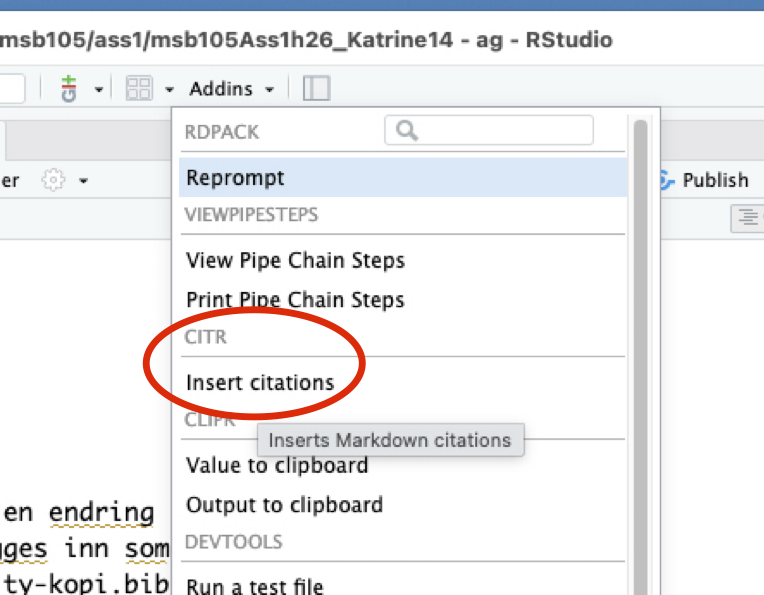
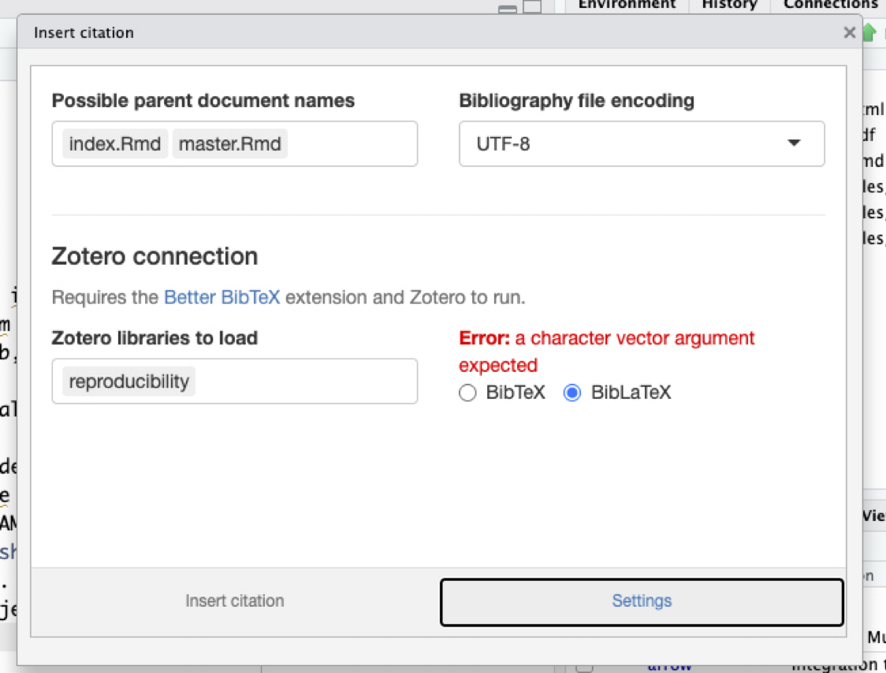
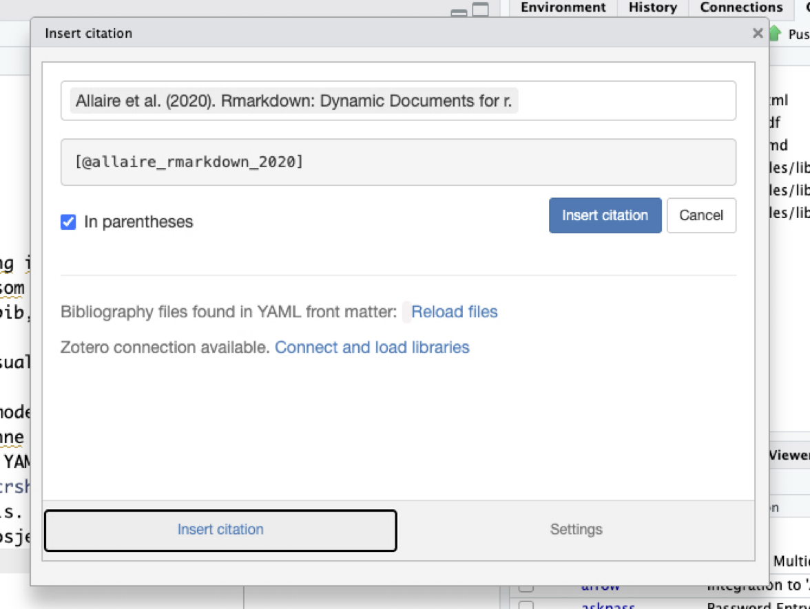
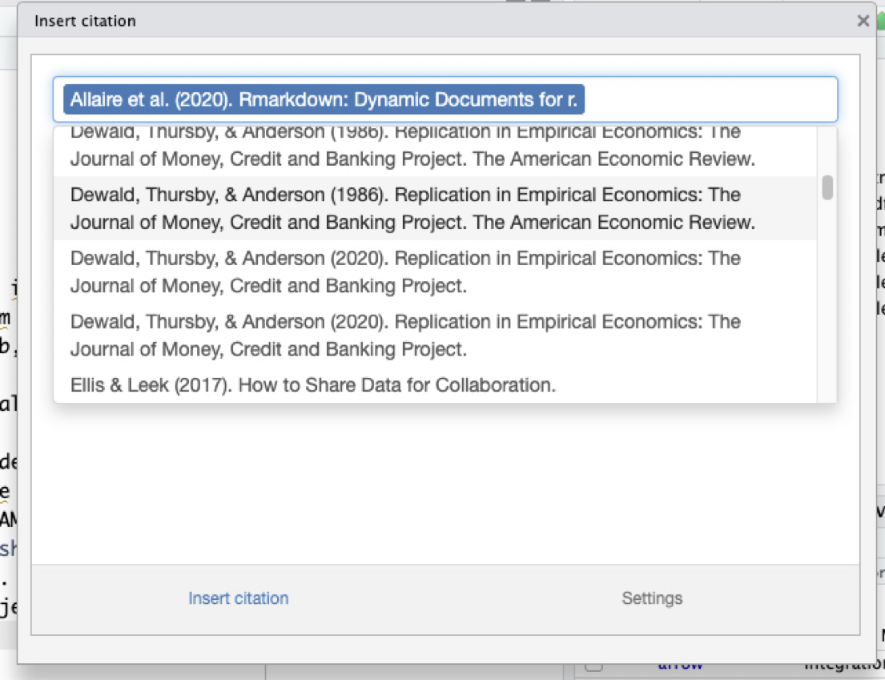
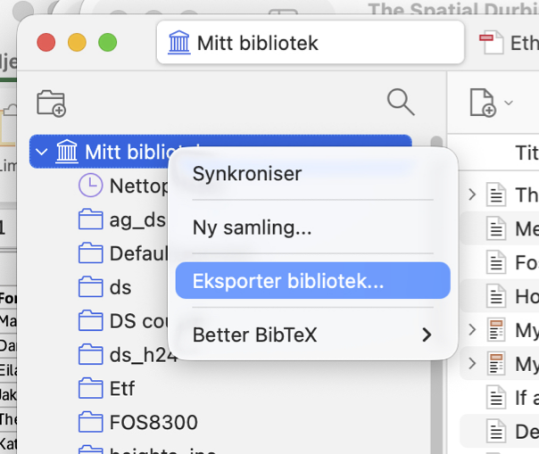
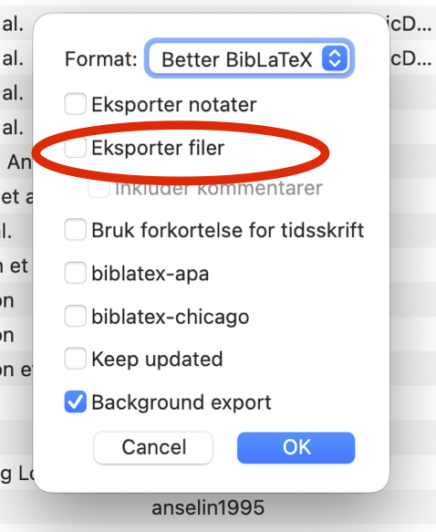

## Kommentarer

- Ser ut som om det har skjedd en endring i Quarto/knitr. Nå må igjen multiple bib filer legges inn som en vektor, dvs. `bibliography: \[reproducibility-kopi.bib, reproducibility.bib\]` hvis **Insert \> Citation…** skal virke i Visual mode. Ser ut til at referansene virker i source mode.
- Jeg tror at å liste bib filene slik du har gjort er det riktige egentlig, men inntil dette er fikset i Visual mode er det kanskje lurest å liste dem i en vektor slik at det virker i begge modes.
- Du burde hatt en referanse til @nsf2019 siden denne gir definisjonen av tre helt sentrale begrep.
- Hvis du foretrekker å jobbe i source mode så kan `citr` være et greit verktøy. En får tilgang til denne under **Addins** og verktøyet leser bib-filene som listes i YAML.
- `citr` kan installeres vha. `pak::pak("crsh/citr")` der `pak` pakken må installeres først på vanlig vis.
- Den kan være at du første må lukke prosjektet for så å åpne det igjen for at `citr` skal synes under **Addins**.

:::: {.columns}

::: {.column width="50%"}
{width="300"}

{width="300"}
::: 
::: {.column width="50%"}
{width="300"} 

{width="300"}
:::
::::

- source mode og citr gir større muligheter for å styre siteringsprosessen og kan være et klokt valg
- ser at du har slått på i Zotero at filen/dokumentet skal lagres lokalt (på din maskin). F.eks `file = {PDF:/Users/katrine/Zotero/storage/VKKS8GU2/Munafò et al. - 2017` `- A manifesto for reproducible science.pdf:application/pdf}`. Dette vil gi masse problemer når du begynner å sammarbeide med andre. Du vil oppleve utallige «merge conflicts» der du må bestemme hvor filen ligger (de andre i gruppen vil ha den plassert et annet sted på sin disk).

:::: {.columns}

::: {.column width="50%"}
{width="200"}
::: 
::: {.column width="50%"}
{width="200"}
:::
::::

- Siterings-info for Quarto finner du [her](https://github.com/quarto-dev/quarto-cli#) i menyen ute til høyre. jeg har lagt den inn i ag.bib.
- Har endret litt i appendiks slik at siteringsverktøyet blir brukt
- Referansene til knitr (Xie) kan enkel genereres vha. `print(citation("knitr"), bibtex=TRUE)`. Legg merke til at verktøyet justere for at de tre referansene er til samme forfatter.
- La inn 2026.09.0+174 som RStudio versjon siden det er den jeg bruker. Samme gjelder for R og Quarto versjon.
- Fine «commit messages». 
- Jeg fikk ikke tilgang til chat-en din så jeg har sendt en forspørsmål om å få tilgang.
